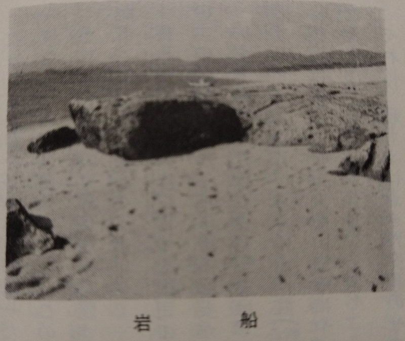

# ORD 10: 折口海岸の堆積

<!-- toc -->

多くの場所で、潮流の変化によって砂浜の砂が流出し、砂浜が消えるという現象が問題となっているらしい。陸地が少なくなったり、生態系に影響があるという。しかし脇本・折口海岸一帯では、逆に砂が流入しているという。かつての堤防や岩石は埋まり、砂浜から水面への傾斜が大きくなっている。

## 撮影年不明

*[阿久根七不思議／阿久根市](https://www.city.akune.lg.jp/soshikikarasagasu/somuka/hishokohogakari/5/1023.html)の画像から*

↑最も古いと思われる画像では、縮尺はわからないが、手前に見える砂や縦横比から、かなり壁感のある高さという感じがする。岩船といわれるのもわかるように思える。

## 1975年(昭和50年)

*阿久根市誌p1122(昭和50年)から。本の撮影時に歪みがある*

↑次に古い画像。陸側から撮影しているため、阿久根市ホームページの画像とは左右反転している。突端に面影を感じる。縮尺がわからないので完全に体感だが高さが半分くらいになったように見える。

## 現在

*埋まっていると思われる付近。黄色で囲った小さなコンクリートは堤防。2020-08撮影*

今は何もない。少なくとも手で掘れる深さにはなさそうだった。近くにある堤防は、もうふくらはぎくらいの高さしかない。もともとの高さを知らないが、少なくとも1m以上は高くなっていそうだ。
