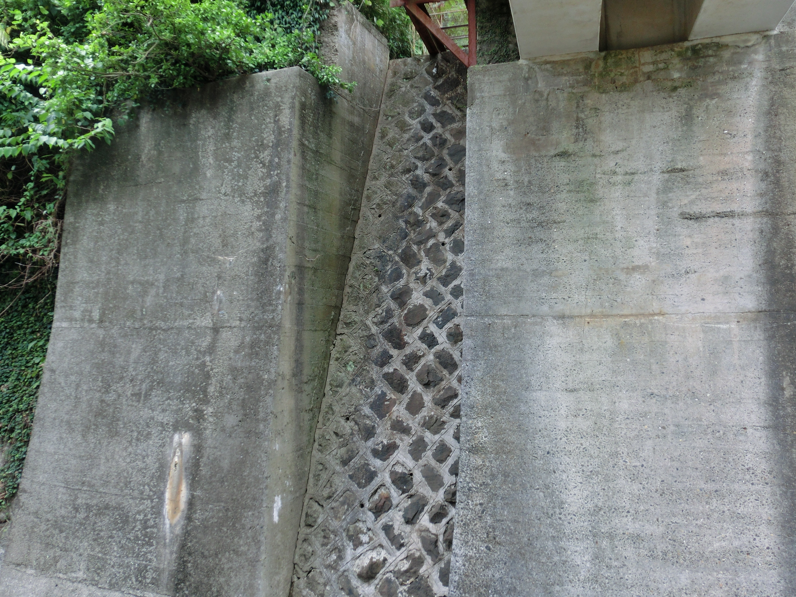
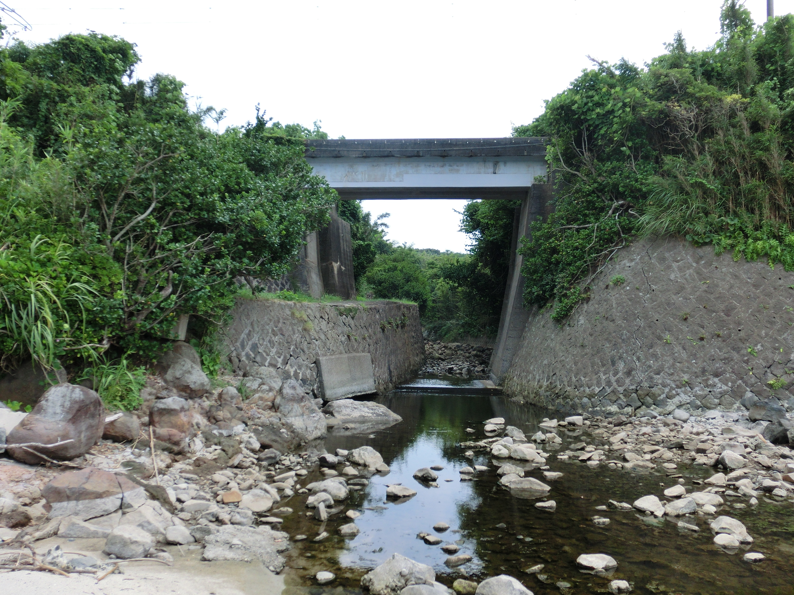
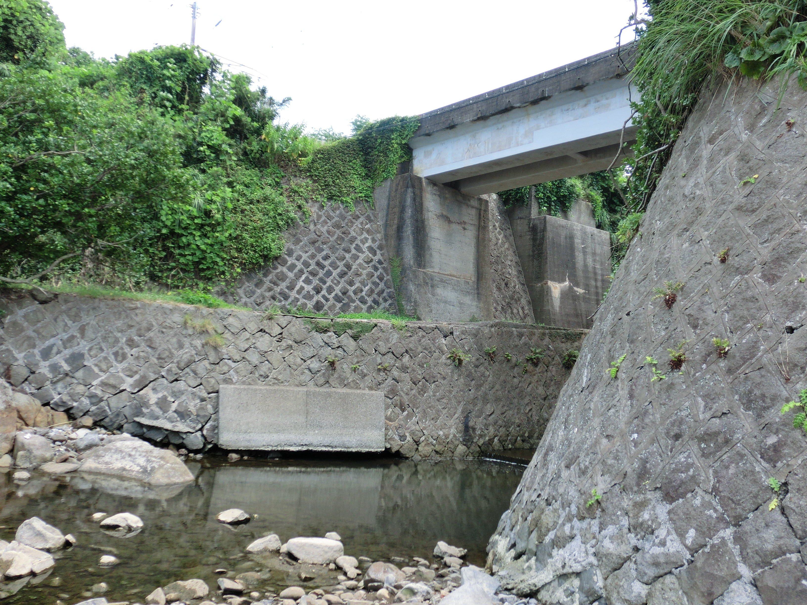

# ORD 17: 中津浜海岸近くにある2つの橋台

<!-- toc -->

- 肥薩おれんじ鉄道の高架がある
- 橋台が2つあり、片方にしか橋が架けられていない
- 橋の前後は2線敷けそうな幅があるように見える
- 航空写真で遡ってみても、ずっと同じ位置にあるように見える
- 外観を見るに、建設された年代に大きな違いはないように見える

*2024-08撮影。橋の下から見る*

*海岸から見る*

*右に回って、海岸から見る*

国土地理院の衛星写真で比較すると、ずれていて、1970年代だと右の位置にあるように見える。ただ、このへんの航空写真は道路や海岸付近など、全体的に右にずれているようだ。地図の歪みの可能性が高い。

ということで航空写真での確認はできていないが、橋の前後でもう一線敷設していたような後は確かにあるようだ。

<iframe frameborder="0" scrolling="no" marginheight="0" marginwidth="0" width="500" height="400" src="https://maps.gsi.go.jp/?hc=hic#18/32.03848/130.203974/&base=ort&ls=ort&disp=1&vs=c1g1j0h0k0l0u0t0z0r0s0m1f1&ls2=ort%7Cgsi-compare-photo&blend2=0&disp2=11"></iframe>
