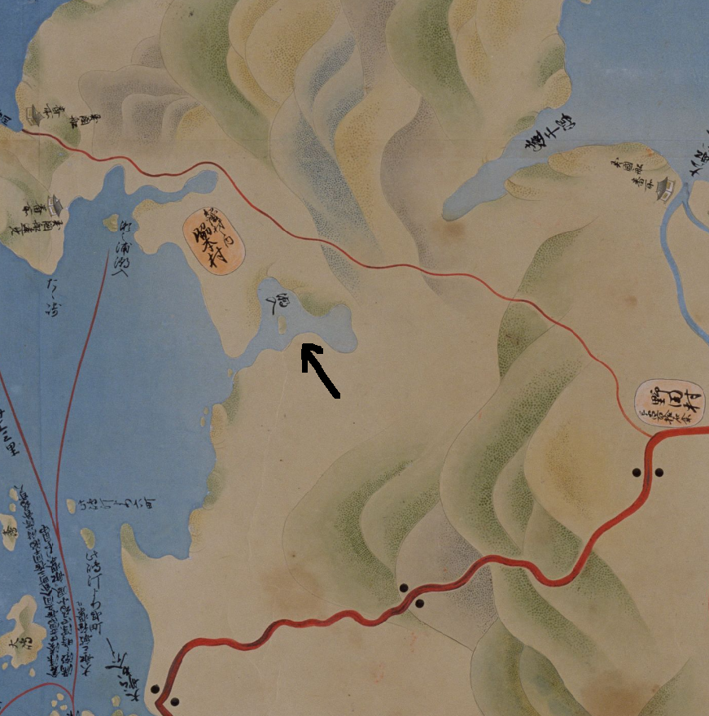
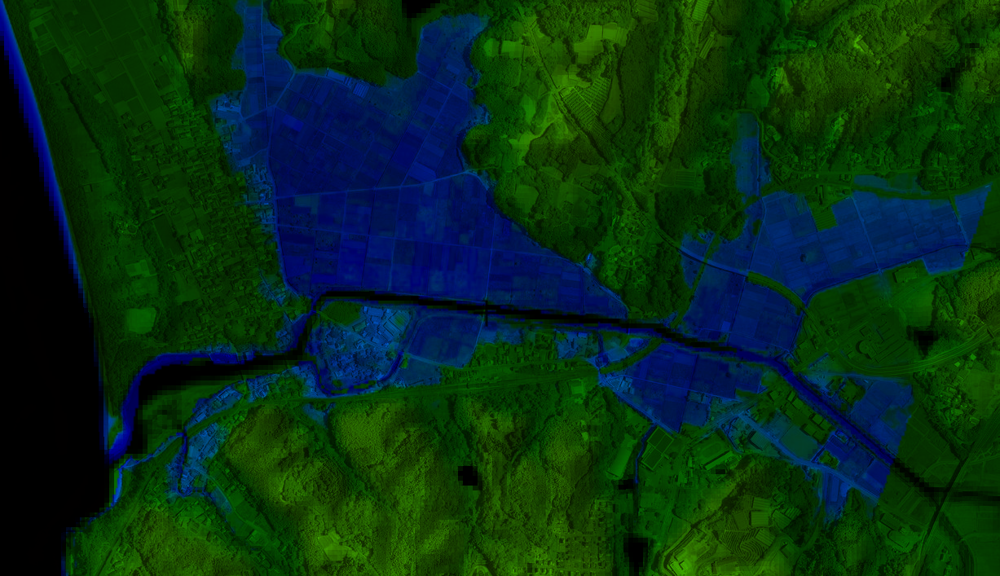

# OR 2: 折口の干拓を標高図で確認する

<!-- toc -->

## 概要

国道3号線あたりまで海が入り込んでいたという。江戸時代に干拓が行われ、それ以来水田として利用されている。

## 江戸時代 元禄(=1688〜1704年)

干拓前。たしかに、入り込んだ湾となっている。

*↑[薩摩国(元禄)](https://www.digital.archives.go.jp/DAS/pickup/view/detail/detailArchives/0301000000/0000000231/00)より矢印追加。*

湾の中に小島が見えるが、これは位置と名前的に田島だ。現在でも周囲と比べてやや高く両側が川に囲まれている。名字や橋の名前として残っている。

*↑現在の標高別地図。地理院地図から高さに色付けして作成。*

形がだいたい一致する。周辺で育った人なら聞く話しだが、折口は昔あたり一面が海だった。そのへんの土を掘ると貝殻が出る。そして地域名の由来は、「海への降り口」だと言われる。海でなくなったのは人為的なもので、割と最近であった。

>多田村の西に位置し、地元では「おいぐち」とも発音する。西は海（東シナ海）に面し、西流する折口川が注ぐ。南は赤瀬川村、北西は出水郷西目村。折口川河口の入江を折口浜とよぶ。かつてこの入江は折口川をさかのぼって多田村辺りまで入り込み、多田浦とよばれていた。元禄年中（一六八八―一七〇四）この浦の干拓が進み、開発地を中心として多田村から分れた村が当村という。
*（阿久根町郷土誌）*

## 明治時代

干拓後となる。明治時代の地図を見ると陸地になっている。

*↑[西海道全圖](https://sagalibdb.jp/iiifviewer/?uid=02000035) 1877年 陸軍参謀局*

## 関連

- [西海道全図の概要](http://www.aobane.com/books/390)
