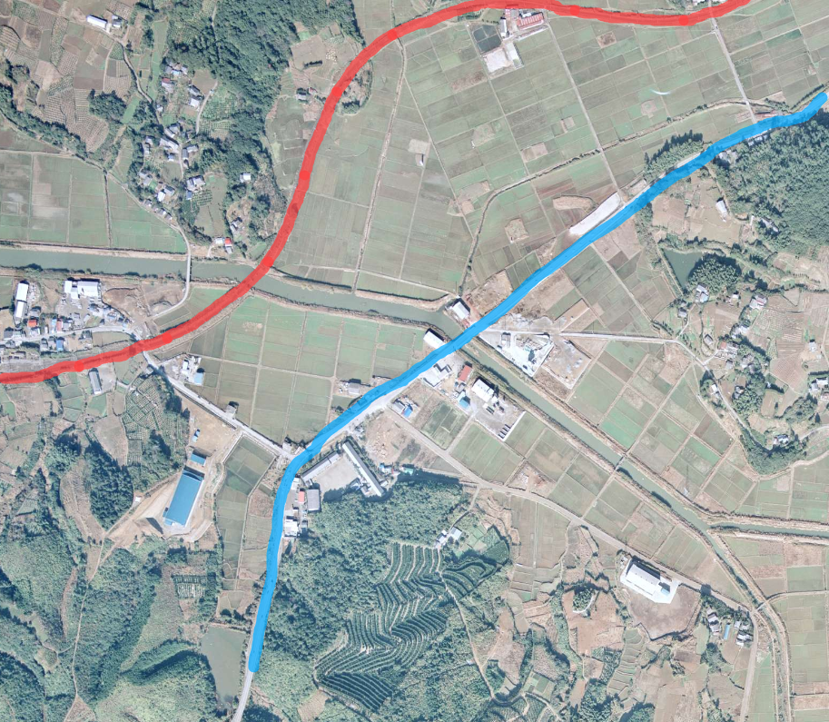
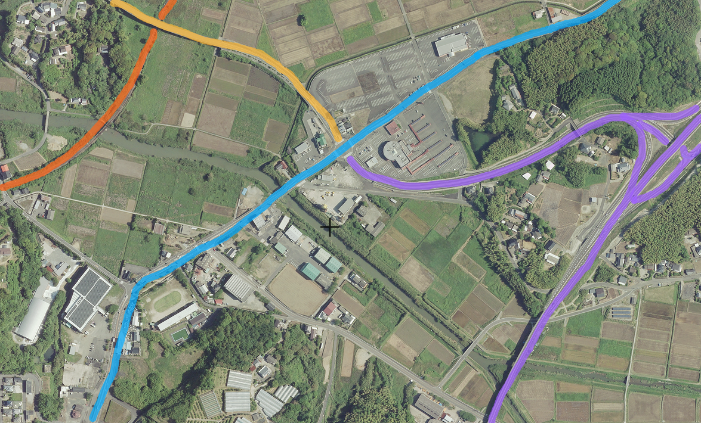

# ORD 3: 折口の主要交通の変遷を比較する

<!-- toc -->

## 概要

鹿児島県阿久根市折口地区の交通がどう形成されてきたかを見る。

<figure>
  <iframe src="https://www.google.com/maps/embed?pb=!1m14!1m12!1m3!1d10866.942048315324!2d130.22276767221672!3d32.05931611947014!2m3!1f0!2f0!3f0!3m2!1i1024!2i768!4f13.1!5e0!3m2!1sen!2sjp!4v1707670312273!5m2!1sen!2sjp" width="600" height="450" style="border:0;" allowfullscreen="" loading="lazy" referrerpolicy="no-referrer-when-downgrade"></iframe>
  <figcaption>現在の折口地区</figcaption>
</figure>

## 江戸時代

江戸時代は特に街道沿いではなかった。折口には何も記載がない。湾は見るからに交通に不便だが、幅の狭い折口川河口部分に渡し舟があったという(出所不明)。

<figure>
  
  <figcaption><a href='https://www.digital.archives.go.jp/DAS/pickup/view/detail/detailArchives/0301000000/0000000231/00'>『薩摩国(元禄)』</a>より</figcaption>
</figure>

## 明治時代

主要道(赤線)が阿久根〜野田、阿久根〜脇本になった。高低差の大きい地形的を通っていて、規格は高くないだろう。現在の国道3号線にあたる道はまだ存在しないか、主要道ではない。

<figure>
  
  <figcaption><a href='https://sagalibdb.jp/iiifviewer/?uid=02000035'>『西海道全圖』</a>より</figcaption>
</figure>

明治後半に国道3号、大正に川内線折口駅が開業した。国道3号は陣之尾峠で、大きな傾斜がある。鉄道は傾斜を避けるため国道3号とは異なる、海側のルートになったのだろうと考えられる。

<figure>
  
  <figcaption><a href='https://purl.stanford.edu/kq741wk9448'>『五万分一地形圖』</a>(明治34年測量、昭和10年修正)より</figcaption>
</figure>

## 昭和時代

<figure>
  
  <figcaption>昭和50年の航空写真。<a href='https://mapps.gsi.go.jp/map-lib-api/apiContentsView.do?specificationId=1041758'>CKU7417-C14</a>を加工した。</figcaption>
</figure>

昭和62年に脇本バイパスが完成した。新設されたバイパスに国道389号があてられ、今まで国道389号だった道路を県道365号[^365]に降格。

<figure>
  
  <figcaption>1999年の航空写真(なぜかモノクロ)。<a href="https://mapps.gsi.go.jp/map-lib-api/apiContentsView.do?specificationId=98774">KU992X-C18-3</a>を加工した</a></figcaption>
</figure>

<figure>
  
  <figcaption><a href='https://www.city.akune.lg.jp/material/files/group/67/kohoS6211.pdf'>『広報あくね』490号</a>より</figcaption>
</figure>

- 旧国道389号線には鉄道との平面交差、狭隘区間があり、脇本地区の物資輸送の妨げとなっていたという。現在でも、全体的に幅員が小さく線形が悪い箇所が多い。歩道すらない箇所も多い

## 平成時代

高規格幹線道路(南九州西回り自動車道)と接続され、初めて高速道路網に組み込まれた。

- 九州新幹線の開業によって鹿児島本線の在来線、薩摩川内〜八代駅間が第三セクター化した。折口駅は肥薩おれんじ鉄道駅となった
- 南九州西回り自動車道の北阿久根インターチェンジが設置され国道3号、国道389号と接続された。

<figure>
  
  <figcaption><a href='https://maps.gsi.go.jp/#17/32.060691/130.226301/&base=std&ls=std%7Cgsi-compare-photo&blend=0&disp=11&lcd=gsi-compare-photo&vs=c1g1j0h0k0l0u0t0z0r0s0m0f1&d=m'>2018年の地理院地図</a>を加工した</figcaption>
</figure>

## 関連

[ORD: 2](./202501010002_2.md)。干拓が行われた。

## 脚注

[^365]: [鹿児島県道365号脇本赤瀬川線 \- Wikipedia](https://ja.wikipedia.org/wiki/%E9%B9%BF%E5%85%90%E5%B3%B6%E7%9C%8C%E9%81%93365%E5%8F%B7%E8%84%87%E6%9C%AC%E8%B5%A4%E7%80%AC%E5%B7%9D%E7%B7%9A)
