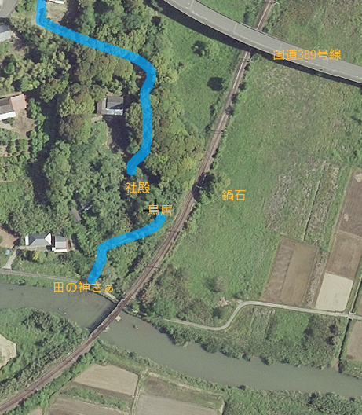

# ORD 9: 鍋石にある伊勢神社を観察する

<!-- toc -->

## 調べる

伊勢神社は茂った木、線路によって外部からまったく見えない位置にある。案内なども特に見かけない。鬱蒼とした森の中でも道の手入れがよくされているので、地区の人々には親しまれているように見える。高台にあって、木々で遮られていなければ、田園の一帯を見晴らせるだろう。

<figure>
  
  <figcaption>行き方。Google Mapの航空写真に図を入れて作成した</figcaption>
</figure>

<figure>
  <iframe src="https://www.google.com/maps/embed?pb=!1m13!1m8!1m3!1d18121.33745317439!2d130.21993000000003!3d32.062735!3m2!1i1024!2i768!4f13.1!3m2!1m1!2zMzLCsDAzJzQ1LjkiTiAxMzDCsDEzJzIxLjAiRQ!5e1!3m2!1sen!2sjp!4v1750723476597!5m2!1sen!2sjp" width="600" height="450" style="border:0;" allowfullscreen="" loading="lazy" referrerpolicy="no-referrer-when-downgrade"></iframe>
  <figcaption>周辺の地図</figcaption>
</figure>

階段を登り鳥居正面、社殿へ向かって歩く。階段はブロックの上にコンクリートを流したもので、接着していなくてガタガタする。

<figure>
  
  <figcaption>2023-12撮影。階段下から社殿方向を見る</figcaption>
</figure>

撮影したのが年末だったため、新年のための縄がかけられている。

<figure>
  
  <figcaption>2023-12撮影。鳥居から社殿方向を見る</figcaption>
</figure>

鳥居には手書きのような書体で「伊勢神社」とある。鳥居の前には階段がある。

<figure>
  
  <figcaption>2024-08撮影。社殿から鳥居方向を見る。撮った時期が違うので、鳥居にかけられた縄はない</figcaption>
</figure>

鳥居の先は藪になっていて、さらにそのさきには見えないが、鉄道の築堤がある。周囲には苔むした大岩が無造作に転がっている。

<figure>
  
  <figcaption>鳥居の先の小さな平場にささやかな社殿がある</figcaption>
</figure>

周囲は高い木々が密集していて、薄暗い。神秘的な雰囲気がある。

<figure>
  
  <figcaption>社殿を近くから見る</figcaption>
</figure>

社殿の前の石碑には新築記念 昭和52年 7月 とある。石碑の近くには日光が差し込んでいて、周囲の木陰との明るさの違いがかなりあるのがわかる。木立によって、衛星写真からも確認できない。
