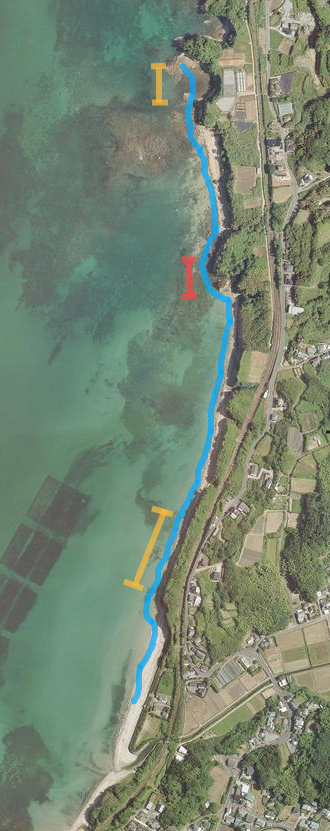
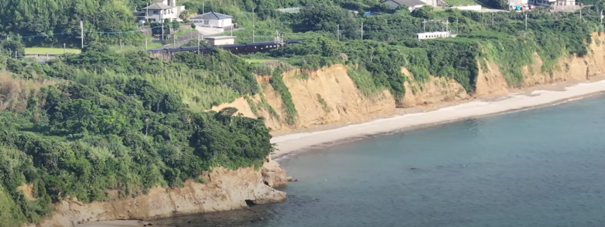
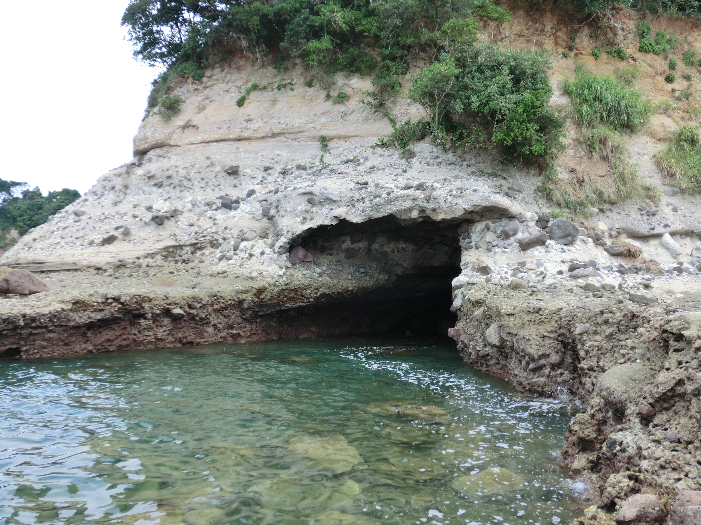
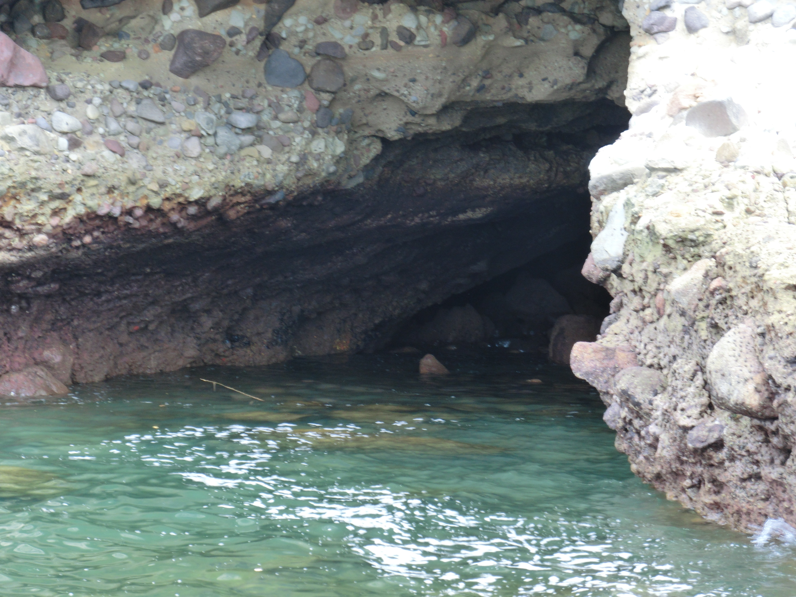

# ORD 20: 牟田の海蝕洞を観察する

## 概要

牟田の海岸に、海蝕洞がある。周囲と隔絶された雄大な秘境を感じられる。

<iframe src="https://www.google.com/maps/embed?pb=!1m17!1m12!1m3!1d4359.17030981828!2d130.20197707650064!3d32.05140697397536!2m3!1f0!2f0!3f0!3m2!1i1024!2i768!4f13.1!3m2!1m1!2zMzLCsDAzJzA1LjEiTiAxMzDCsDEyJzE2LjQiRQ!5e1!3m2!1sen!2sjp!4v1726397405859!5m2!1sen!2sjp" width="600" height="450" style="border:0;" allowfullscreen="" loading="lazy" referrerpolicy="no-referrer-when-downgrade"></iframe>

## アクセス

砂浜からアクセスした。

このような南側からのルートで、**潮位が充分に低いと**普通に地面を歩くだけで到達できる。潮位29だと余裕で行ける。赤色の部分がシビアな部分で、黄色を通過できても、まだ赤色の部分は海中で、通行できないことがある。

距離が長いが、アクセスする方法に乏しく、一番安全である。

*周辺の切り立った崖と崖下の砂浜。<https://www.youtube.com/watch?v=6wqgxvOMQkc> の12:14あたりを切り抜いた*

↑一帯の砂浜はこのような絶望的な高低差のため、陸上からのアクセスが難しい。いくつか壁をよじ登るような獣道は存在しているのだが、激藪に覆われていて発見が困難なのと、一帯は農地であり農家の人に怪しまれるので、海沿いに歩くのが一番良い。

## 海蝕洞

*海蝕洞。2024-08撮影*

↑開口部上にある木を見ると、なんとなくスケール感がわかる。隠された乗り物が出てきそうな、秘密基地チックなデザインをしている。いい具合の四角い形をしていて、さらにそのまま海に出発できる感じで海の道が開けている。

*海蝕洞にズーム*

↑空洞は右に入り込んでいて、洞窟の行き止まり部分は確認できない。いくつか転がった岩が海面上に見えている。

*洞窟の上を見る*

↑洞窟の上は岸壁になっていて、圧倒される。これだけの重さを上に乗せて、それなりの横幅と深さが空洞になっているのを周囲の壁が支えている。あとどれだけ耐えられるのか想像もつかない。

開口部直上の、オーバーハングした部分に生えている頼りない木には、古びたロープがかけられていた。このロープで開口部直上を通って対岸に渡れということなんだろうが、恐ろしくてできなかった。同じものという確信はないが、このロープは、約15年前(2009年)からかけられていた記憶がある。

*洞窟直上のひさし部分から、開口部を下に見る*

↑これが精一杯だった。高さがある上に、足場が傾斜していて怖い。かなり潮位は低いにも関わらず、海面は深い色をしていた。常時海水で満たされているのだろう。

数メートルを海に隔てられた2つの陸地が見えるが、距離以上に遠い。上部の斜面を渡りきるか泳がないとたどり着けない。

## 関連

なし。
