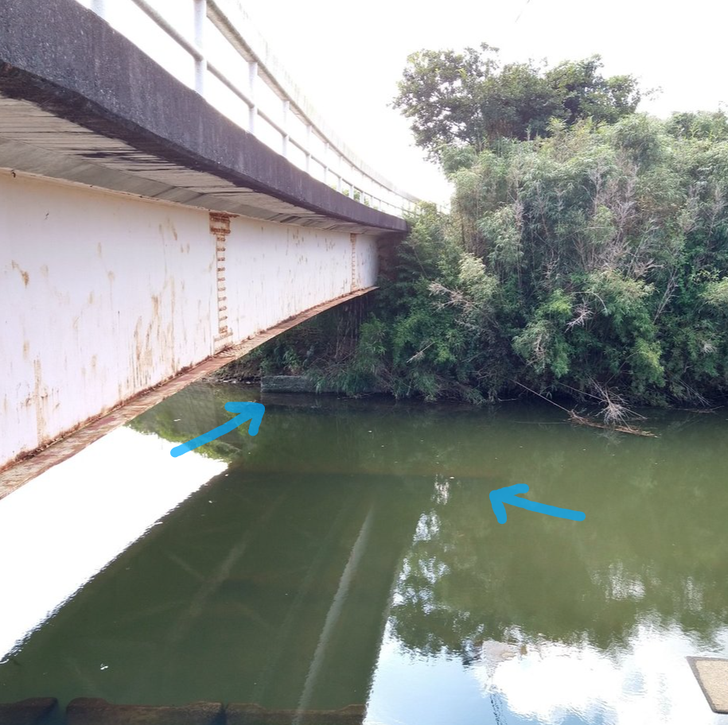
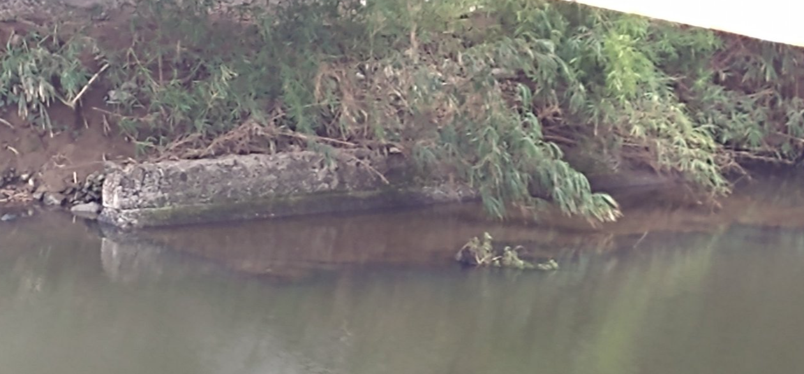

# ORD 21: 田島橋下にある構造物は何か?

## 概要

田島橋は、阿久根市折口にある橋である。昭和42(1967)年竣工とのこと。

<iframe src="https://www.google.com/maps/embed?pb=!1m17!1m12!1m3!1d4508.324744097074!2d130.2080890898374!3d32.062657906854824!2m3!1f0!2f0!3f0!3m2!1i1024!2i768!4f13.1!3m2!1m1!2zMzLCsDAzJzQ1LjYiTiAxMzDCsDEyJzQ2LjciRQ!5e1!3m2!1sen!2sjp!4v1731816267661!5m2!1sen!2sjp" width="600" height="450" style="border:0;" allowfullscreen="" loading="lazy" referrerpolicy="no-referrer-when-downgrade"></iframe>

橋の下には、何かの構造物がある。

*2023年撮影。下流側の橋台から東に撮影した*

水中にある細長いものと、水中から伸びて水面から突き出すコンクリートの基礎っぽい何か。以前かかっていた橋の痕跡ではと考えているが、確証はない。

*2023年撮影。上流側の堤防から東に撮影した*

<!-- ## カーブ -->

<!-- 航空写真だとわかりにくいが、橋はややカーブしている。 -->

<!--  -->
<!-- *Googleストリートビューより* -->

<!--  -->
<!-- *2024年8月撮影。西に向けて撮影した* -->

<!-- ## 疑問 -->

<!-- カーブするには、それなりの理由があるはずである。 -->

## 関連

なし。
