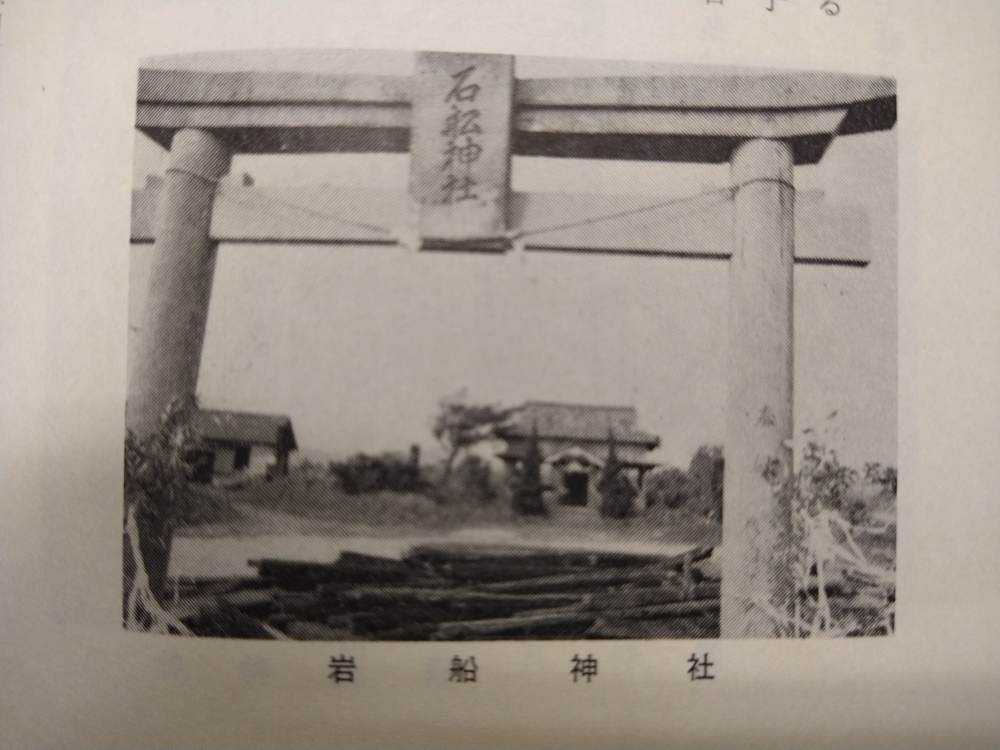
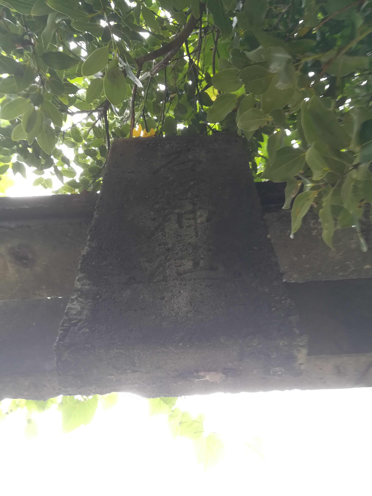

# ORD 24: 岩船神社を古写真で比較する

## 概要

岩船神社の鳥居と社殿を写した古い写真がある。現在は、鳥居の向こう側は森が迫っていて、同じアングルで撮ることはできない。

<iframe src="https://www.google.com/maps/embed?pb=!1m18!1m12!1m3!1d835.1626247987099!2d130.20838651746124!3d32.06163475930198!2m3!1f0!2f0!3f0!3m2!1i1024!2i768!4f13.1!3m3!1m2!1s0x353fcc8b0ce3bf8f%3A0x8798b82f08e2255d!2sIwafune%20Shrine!5e1!3m2!1sen!2sjp!4v1731826335810!5m2!1sen!2sjp" width="600" height="450" style="border:0;" allowfullscreen="" loading="lazy" referrerpolicy="no-referrer-when-downgrade"></iframe>

*阿久根市誌より*

- ↑
- 白黒写真でよくわからないが、もともとは白色だった? 現在は黒色に見える。コンクリート製の鳥居の表面は傷みが目立った。海風のためか、侵食が激しいように見える
- 木々が少なく、空が広く見える
- 鳥居の後ろに転がっている材木?は何なのだろう

*2022年ごろ撮影*

- ↑
- 現在の鳥居には「昭和42年9月再建」とあった。古写真に写っている鳥居と同じだろう

*2020年ごろ撮影*
