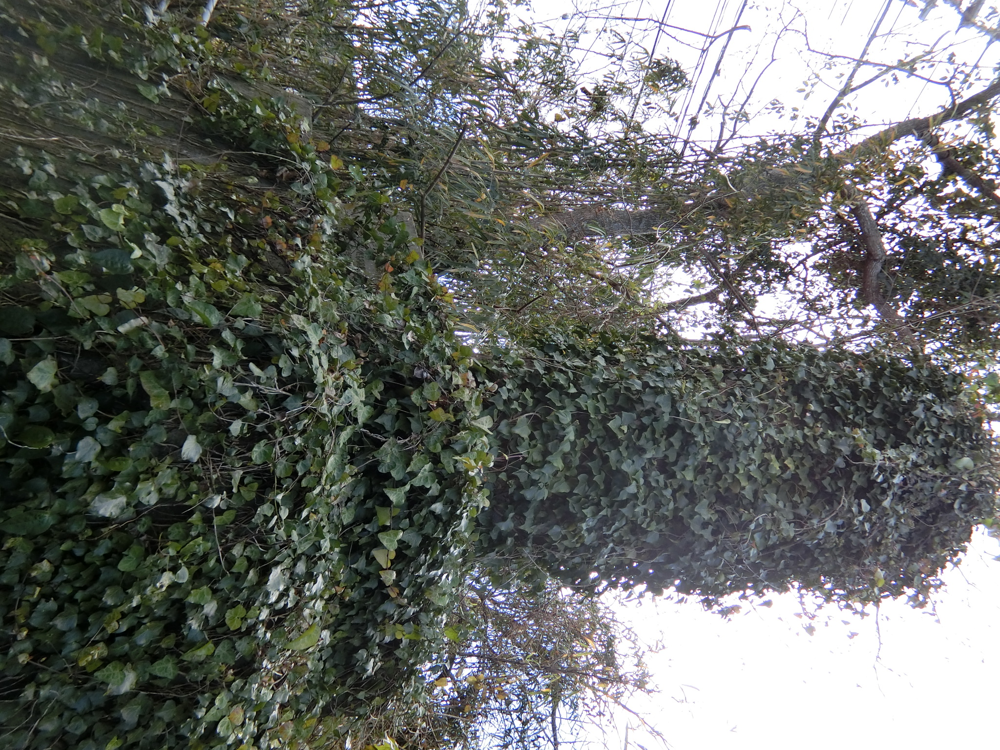

# ORD 29: 土地改良記念碑を観察する

昭和26年に着工した鹿児島県の土地改良によって、阿久根市折多地区は様変わりした。当時の土地改良記念碑があることは知っていたのだが、どこにあるかがわかっていなかった。

<figure>
  
  <figcaption>『阿久根市報』昭和32年10月号より</figcaption>
</figure>

古いストリートビューを眺めていて、たまたま発見した。

<figure>
  <iframe src="https://www.google.com/maps/embed?pb=!4v1750596407117!6m8!1m7!1saPs5dDb66pwbzo4mVGowKg!2m2!1d32.06119608820146!2d130.2253876457155!3f9.478513739572588!4f0.9325730855880039!5f2.613667841247745" width="600" height="450" style="border:0;" allowfullscreen="" loading="lazy" referrerpolicy="no-referrer-when-downgrade"></iframe>
  <figcaption>2012年。石の柱が見える</figcaption>
</figure>

<figure>
  <iframe src="https://www.google.com/maps/embed?pb=!4v1750579835196!6m8!1m7!1sbfwjgwVNwsK55W8_K6yT9Q!2m2!1d32.06118415846171!2d130.2253680657713!3f7.922903762587794!4f-5.173834490674167!5f0.7820865974627469" width="600" height="450" style="border:0;" allowfullscreen="" loading="lazy" referrerpolicy="no-referrer-when-downgrade"></iframe>
  <figcaption>2024年。草木が成長して何も見えない</figcaption>
</figure>

外からは見えないが、土手上の道は最低限管理されているようで、草が刈られて1人通れるスペースがあり、撮影できた。

<figure>
  
  <figcaption>2025年1月ごろ撮影。国道3号側に向かって撮影した</figcaption>
</figure>

観察する。

- 3~4メートルある
- 折口川の土手上に築かれている
- 国道3号が後ろになるように撮影している(石碑の裏面が写っている)
- 表面は国道3号から見えやすい方向にある。「土地改良記念碑」と大きく刻まれている
- 石碑は協賛者が彫られた土台部分と、題が彫られた一枚岩からなる

場所は、国道3号線が折口川を渡る橋(陣之尾橋)の付近にある。

<figure>
<iframe src="https://www.google.com/maps/embed?pb=!1m17!1m12!1m3!1d4080.4399867872717!2d130.2244207667938!3d32.06099876365171!2m3!1f0!2f0!3f0!3m2!1i1024!2i768!4f13.1!3m2!1m1!2zMzLCsDAzJzQxLjEiTiAxMzDCsDEzJzMxLjUiRQ!5e1!3m2!1sen!2sjp!4v1750556804018!5m2!1sen!2sjp" width="600" height="450" style="border:0;" allowfullscreen="" loading="lazy" referrerpolicy="no-referrer-when-downgrade"></iframe>
  <figcaption>土地改良記念碑の位置。国道のガードレールの隙間からアクセスできる</figcaption>
</figure>

見てわかるとおり、本体は完全に蔦に覆われ、存在を忘れ去られている。周囲も高い草木に覆われていて、このサイズに関わらず周りからは全く見えない。これはこれで自然に任せた廃墟感があって魅力を感じることもありそうだが、先人が建立した目的を達してはいない。当時の人たちは喜びや誇りを後世に**伝える**ために建立したはずだ。
