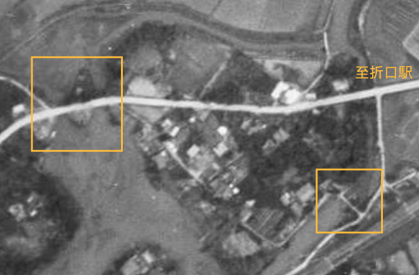

# ORD 32: 田島橋付近にある改修記念碑には水門が記載されている

<!-- toc -->

## 概要

鹿児島県阿久根市折口の田島橋の近くに、ひっそりと改修記念碑がある。

<figure>
  <iframe src="https://www.google.com/maps/embed?pb=!4v1750596364629!6m8!1m7!1sN3eujlX5I_whXUO5vhi04w!2m2!1d32.0627379175182!2d130.2126090735217!3f172.44178198926176!4f-8.65714637378376!5f3.325193203789971" width="600" height="450" style="border:0;" allowfullscreen="" loading="lazy" referrerpolicy="no-referrer-when-downgrade"></iframe>
  <figcaption>改修記念碑の位置</figcaption>
</figure>

<figure>
  
  <figcaption>2023年ごろ撮影した</figcaption>
</figure>

```
   水    里
   門    道
 大   改
 正   修
 七   紀
 年   念
 　   碑
 x
 x
```

なぜこういう書き方になっているのか、記念碑の書式を知らないのでわからないが、ストレートに解釈すると里道と水門を改修した記念碑、ということだろう。

ここからわかること。

- 「改修」なので、里道および水門が大正7年以前から存在していた
- 里道と水門は近く、あるいは一体として存在していた

<!-- 別のエントリにしたほうがいいかも -->

閲覧できる中で、当時に一番近い航空写真を見てみよう。戦後の土地改良工事以前なので、川の流路や幅が今と違う。川から少し離れた今の石碑の位置は正しいようにも見える。

<figure>
  
  <figcaption>1948年撮影。<a href="https://service.gsi.go.jp/map-photos/app/map?search=photo&id=41735&search_date_from=0000&search_date_to=9999#15/32.06340097100002/130.221917765">地図・空中写真閲覧サービス</a>を加工した</figcaption>
</figure>

<figure>
  <iframe src="https://www.google.com/maps/embed?pb=!1m17!1m12!1m3!1d523.8917889165459!2d130.21310550243595!3d32.06202999673604!2m3!1f31.436086270384067!2f0!3f0!3m2!1i1024!2i768!4f35!3m2!1m1!2zMzLCsDAzJzQzLjMiTiAxMzDCsDEyJzUwLjUiRQ!5e1!3m2!1sen!2sjp!4v1751159655027!5m2!1sen!2sjp" width="600" height="450" style="border:0;" allowfullscreen="" loading="lazy" referrerpolicy="no-referrer-when-downgrade"></iframe>
  <figcaption>現在の周辺写真</figcaption>
</figure>

橋が渡る川の中央には陸地があり、水門を設置できそうな地形になっていることがわかる。二股に分かれた川の両側とも、狭まった位置に橋がある。橋はそういう位置にかけるから当然の可能性もある。

ほど近い干拓地の出水市江内に残る、江戸時代の樋門は以下のようになっている。こういったもののイメージをしている。開閉を人力で操作し水門上まで移動できること、強度上の問題で仕切る板を短く複数枚にすること、などでこういった形に落ち着くように見える。

<figure>
  <iframe src="https://www.google.com/maps/embed?pb=!4v1750597885646!6m8!1m7!1s5_82mTm6k56W7wKbsp9JNQ!2m2!1d32.1088407891158!2d130.2636158192757!3f264.62817436617064!4f-6.656928083664482!5f0.7820865974627469" width="600" height="450" style="border:0;" allowfullscreen="" loading="lazy" referrerpolicy="no-referrer-when-downgrade"></iframe>
  <figcaption>鹿児島県出水市江内に残る、江戸時代に作られたという樋門</figcaption>
</figure>

予測地点が決まった。しかし過去あったとしても、川まわりの地形が全く変わっているので、何か残っている可能性は多くなさそうに見える。

## 関連

- [ORD 31: 折口浦干拓時の樋門はどこにあるのか?](./202506221917_31.md)。出発点となる疑問
