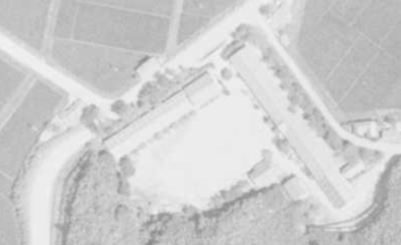
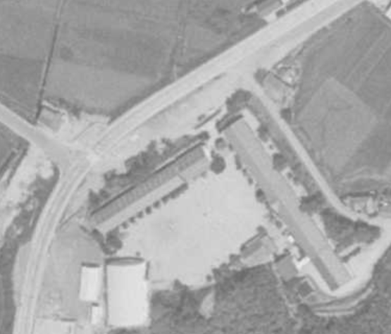

# ORD 37: 折多小学校前の国道の工事前後を比較する

<!-- toc -->

## 概要

<!-- 概要を書く -->

[ORD 27: 折多小学校前の線形改良を比較する](./202501010027_27.md)で変化が存在してそうなことを確認した。より比較しやすい空中写真を見つけたので、確認する。

前。

<figure>
  
  <figcaption><a href="https://service.gsi.go.jp/map-photos/app/map?search=photo&id=549914&search_date_from=0000&search_date_to=9999&color_type_ids=1%2C2&scale_from=0&scale_to=99999999&lon_min=130.1639211330115&lon_max=130.2781679429854&lat_min=32.04938125948773&lat_max=32.0778762056587#14/32.057457317/130.228417333">国土地理院の空中写真</a>を加工した 1963年</figcaption>
</figure>

後。

<figure>
  
  <figcaption><a href="https://service.gsi.go.jp/map-photos/app/map?search=photo&id=570074&search_date_from=0000&search_date_to=9999&color_type_ids=1%2C2&scale_from=0&scale_to=99999999&lon_min=130.1639211330115&lon_max=130.2781679429854&lat_min=32.04938125948773&lat_max=32.0778762056587#14/32.06953941100001/130.235333076">国土地理院の空中写真</a>を加工した 1968年</figcaption>
</figure>

- 工事直後であり、付け替え前の痕跡が明確に見える。ちょうど道路一本分ほど上に移動している
- 工事は1963年~1968年に行われた
- 画像には含まれていないが、周辺の道路の線形も改良されている。現在でも周辺に不自然に広い歩道として残っている
- 左下の森はなくなっている。同時に造成されて平坦になったように見える
- 左下に体育館ができている

## 関連

<!-- 関連するエントリやリンクを記載する -->

- [ORD 27: 折多小学校前の線形改良を比較する](./202501010027_27.md)
