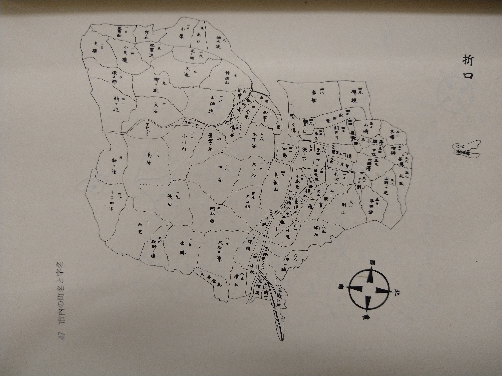

# ORD 39: 折口の字名を見る

<!-- toc -->

## 概要

鹿児島県阿久根市折口の字名を見る。

<figure>
  
  <figcaption>『阿久根市史』p47より</figcaption>
</figure>

## メモ

- 一度も目にしたことがない地名が並ぶ。現代と関係ないだろうと思っていたが、登記には記載されていて、いまだに使われている
- おおまかに分類する地区名は住所として残っているようだ。地図にも載っている。鍋石、牟田、永田...。これらは多くある字の一部にすぎない。住所名は法的にどういう根拠で決められるのだろうか
- 「穴ノ上」という地名があり、これは海蝕洞付近である。面白い自然物のわりに、その所在のヒントはなく全く知られていないのが気になっていた

## 関連

<!-- 関連するエントリやリンクを記載する -->

なし。
