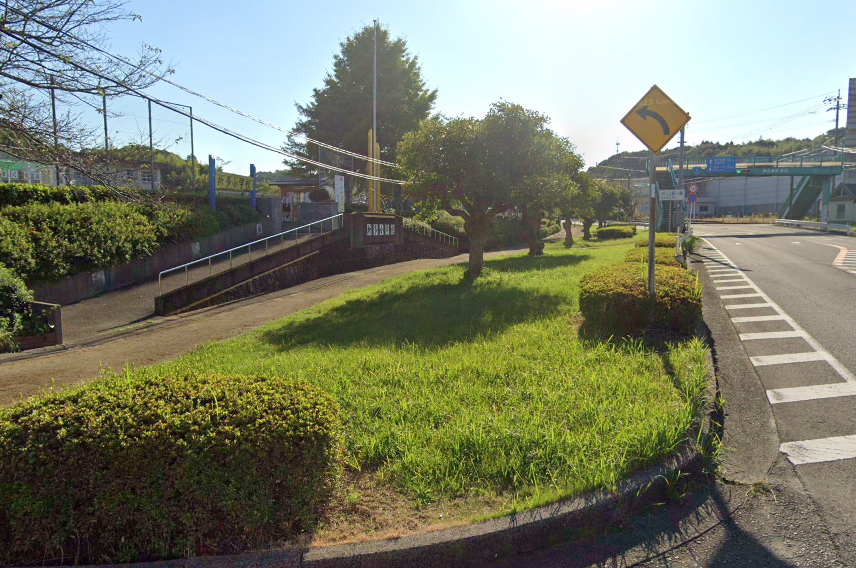

# ORD 22: 折多小学校前の歩道帯はなぜ幅が広いのか?

## 概要

折多小学校前の前の歩道帯は、広く取られている。緑化部分も合わせると、隣の国道3号線の道路と同じくらいの幅がある。

また、校門前はスロープと階段で構成されている。広いスペースまで直線の階段1つでいいように見えるが、このスタイルになっているのはなぜなのだろうか。

<iframe src="https://www.google.com/maps/embed?pb=!1m17!1m12!1m3!1d1127.115475496906!2d130.2219852759452!3d32.05987499417875!2m3!1f0!2f0!3f0!3m2!1i1024!2i768!4f13.1!3m2!1m1!2zMzLCsDAzJzM1LjYiTiAxMzDCsDEzJzIzLjUiRQ!5e1!3m2!1sen!2sjp!4v1731819008008!5m2!1sen!2sjp" width="600" height="450" style="border:0;" allowfullscreen="" loading="lazy" referrerpolicy="no-referrer-when-downgrade"></iframe>

*2024年のGoogleストリートビューから*
