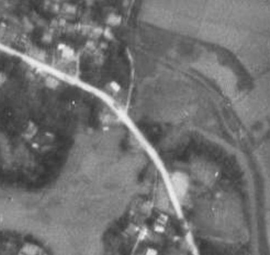

# ORD 26: 土地改良前の田島橋周辺の航空写真を比較する

1948年と現在(2024年)の航空写真を比較した。土地改良前なので、折口川の流路が大きく違う。

*<https://nemotos-office.sakura.ne.jp/14-4.html>上で作成。GIF作成をどうにかできないものか...*

- 写真の歪みと重ねの誤差がかなりあるだろうが、周辺の道路の位置はほぼ一致しているように見える
- 画像右にある新川橋、画像左にある折口橋は現在架かっているものと同じはずなので、位置と形状は信頼できる
- 旧田島橋の位置はごくわずかに下にあるように見える。1メートルないくらいに見える
- 川幅は現在の2倍ほどあり、その分橋の長さが長い。真ん中の島で橋は2つの部分に分かれていたのかもしれない
- ダイヤ型の中洲のようなものがあって流路が狭い。どのくらいの高さがあったのかはわからない。中洲の左側の流路はとくに狭く、道路部分だけがつながっていて橋がかかっているように見える

*https://mapps.gsi.go.jp/map-lib-api/apiContentsView.do?specificationId=42918*

↑別角度で見る。

- 水面部分には橋による影があって、橋の真ん中の陸地には橋による影がない。同じくらいの高さがあったように見える。

## 元画像

- <https://mapps.gsi.go.jp/map-lib-api/apiContentsView.do?specificationId=42917>

## 関連

- [ORD 21](./21.md)。調べるきっかけになった疑問
