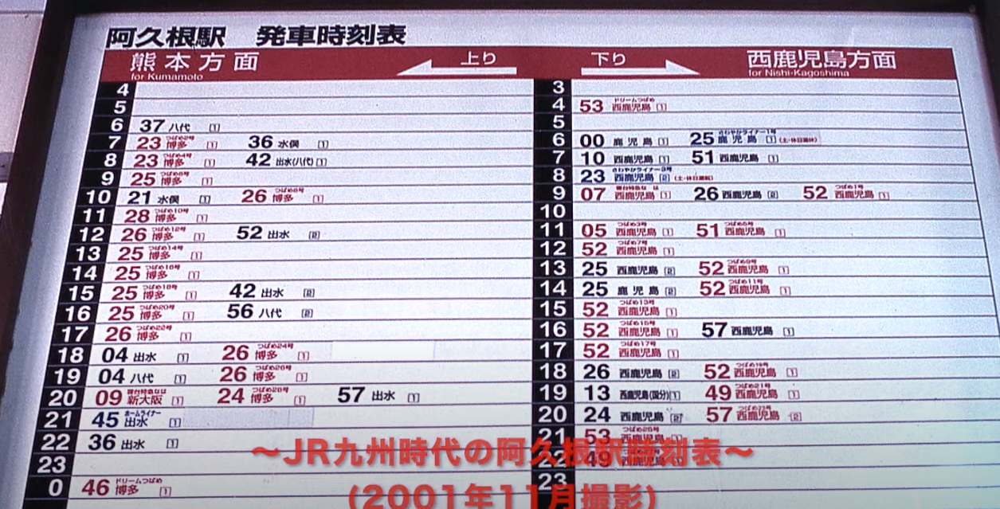

# ORD 6: JR時代の阿久根駅の時刻表

## 時刻表

JR時代の阿久根駅の時刻表。現在では鹿児島側は川内、熊本側は八代までしか行けない。乗り継げばいい話だが。

<iframe width="560" height="315" src="https://www.youtube.com/embed/6nLj4bOrK5s?si=d9oWlgJKHVnwOvYE&amp;start=20" title="YouTube video player" frameborder="0" allow="accelerometer; autoplay; clipboard-write; encrypted-media; gyroscope; picture-in-picture; web-share" allowfullscreen></iframe>

2001年11月当時の時刻表。

| 時刻 | 熊本方面 上り                                      | 時刻 | 西鹿児島方面  下り                                            |
|------|----------------------------------------------------|------|---------------------------------------------------------------|
| 3    |                                                    | 3    |                                                               |
| 4    |                                                    | 4    | **53 ドリームつばめ西鹿児島**                                 |
| 5    |                                                    | 5    |                                                               |
| 6    | 37 八代                                            | 6    | 00 鹿児島 25 さわやかライナー鹿児島                           |
| 7    | **23 つばめ博多** 36 水俣                          | 7    | 10 西鹿児島 51 西鹿児島                                       |
| 8    | **23 つばめ博多** 42 出水(八代)                    | 8    | **23 さわやかライナー西鹿児島**                               |
| 9    | **25 つばめ博多**                                  | 9    | **07 寝台特急なは西鹿児島** 26 西鹿児島 **52 つばめ西鹿児島** |
| 10   | 21 水俣 **26 つばめ博多**                          | 10   |                                                               |
| 11   | 28 **つばめ博多**                                  | 11   | **05 つばめ西鹿児島** **51 つばめ西鹿児島**                   |
| 12   | 26 **つばめ博多** 52 出水                          | 12   | **52 つばめ西鹿児島**                                         |
| 13   | 25 **つばめ博多**                                  | 13   | 25 西鹿児島 **52 つばめ西鹿児島**                             |
| 14   | 25 **つばめ博多**                                  | 14   | 25 鹿児島 **52 つばめ西鹿児島**                               |
| 15   | 25 **つばめ博多** 42 出水                          | 15   | **52 つばめ西鹿児島**                                         |
| 16   | 25 **つばめ博多** 56 八代                          | 16   | **52 つばめ西鹿児島** 57 西鹿児島                             |
| 17   | 26 **つばめ博多**                                  | 17   | **52 つばめ西鹿児島**                                             |
| 18   | 04 出水 **26 つばめ博多**                          | 18   | 26 西鹿児島 **52 つばめ西鹿児島**                                 |
| 19   | 04 八代 **26 つばめ博多**                          | 19   | 13 西鹿児島 **49 つばめ西鹿児島**                                 |
| 20   | **09 寝台特急なは新大阪** **24 つばめ博多** 57出水 | 20   | 24 西鹿児島 **57 つばめ西鹿児島**                                 |
| 21   | 45 ホームライナー出水                              | 21   | **53 つばめ西鹿児島**                                             |
| 22   | 36 出水                                            | 22   | **49 つばめ西鹿児島**                                             |
| 23   |                                                    | 23   |                                                               |
| 0    | **46 ドリームつばめ博多**                          | 0    |                                                               |
