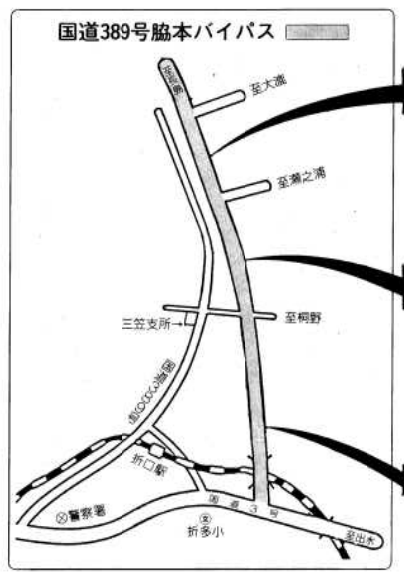

# 折口の変遷

## 時代の変遷

折口地区は、時代の変遷とともに役割を変えてきた。

### 江戸時代 元禄(=1688〜1704年)

干拓前。

↑[薩摩国(元禄)](https://www.digital.archives.go.jp/DAS/pickup/view/detail/detailArchives/0301000000/0000000231/00)より。田島は本当に島だった。

↑現在の標高別地図。だいたい一致する。地理院地図より作成。

周辺で育った人なら聞く話しだが、折口地区は一面が海だった。土を掘ると貝殻が出てくる話とセットで語られる。そして地域名の由来は、「海への降り口」である。海でなくなったのは人為的なもので、割と最近であった。

>多田村の西に位置し、地元では「おいぐち」とも発音する。西は海（東シナ海）に面し、西流する折口川が注ぐ。南は赤瀬川村、北西は出水郷西目村。折口川河口の入江を折口浜とよぶ。かつてこの入江は折口川をさかのぼって多田村辺りまで入り込み、多田浦とよばれていた。元禄年中（一六八八―一七〇四）この浦の干拓が進み、開発地を中心として多田村から分れた村が当村という（阿久根町郷土誌）。

### 明治時代

干拓後。

↑[西海道全圖](https://sagalibdb.jp/iiifviewer/?uid=02000035) 1877年 陸軍参謀局

- [西海道全図](http://www.aobane.com/books/390)の概要
- 主要道が阿久根〜野田、阿久根〜脇本になっている。現在残っている感じから見る限り、規格の高くない道で自動車のための道ではない
- 現在の地名とほぼ同じ
- 現在の国道3号線にあたる道は存在しないか、主要道ではない

### 昭和時代(前)

↑[五万分一地形圖](https://purl.stanford.edu/kq741wk9448) 明治34年測量、昭和10年修正

- 鹿児島本線の折口駅が開業した(1923年)
  - 傾斜とトンネルを避けて海側を通した?
- 現在の国道3号と同じ位置に道路ができた
  - 折口は阿久根脇本間道路と、国道3号間の連絡路となった

### 昭和時代(後)

- 戦後土地改良工事が行われ折口川が直線化した
  - 同時期に橋がいくつかかけられた

### 平成

脇本バイパスが完成した。新設されたバイパスに国道389号があてられ、今まで国道389号だった道路を県道365号に降格。

 [広報あくね490号](https://www.city.akune.lg.jp/material/files/group/67/kohoS6211.pdf)より

- 旧国道389号線には鉄道との平面交差、狭隘区間があり、脇本地区の物資輸送の妨げとなっていた

南九州西回り自動車道のインターチェンジが設置された。北薩横断道路の終点として設定された(未定)。
